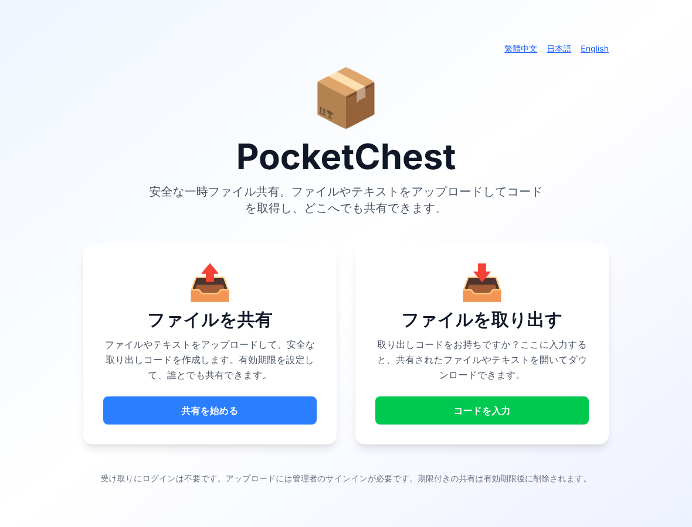
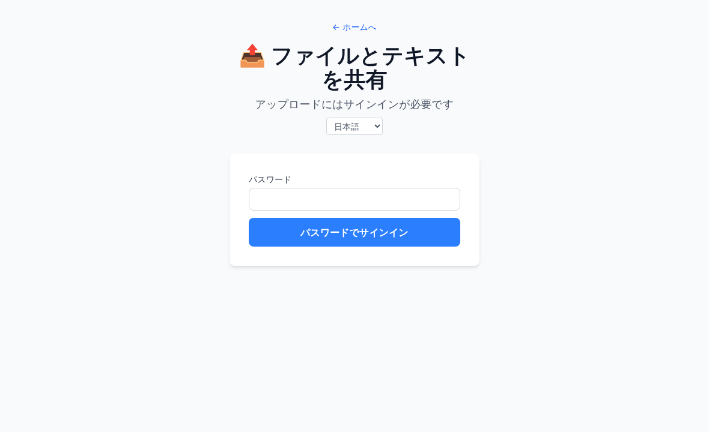
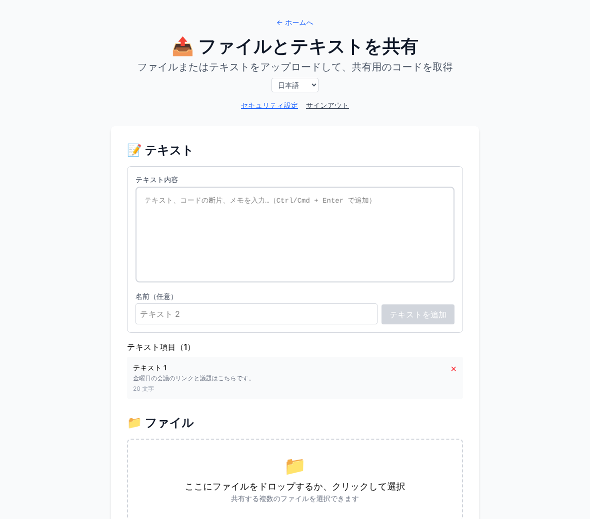
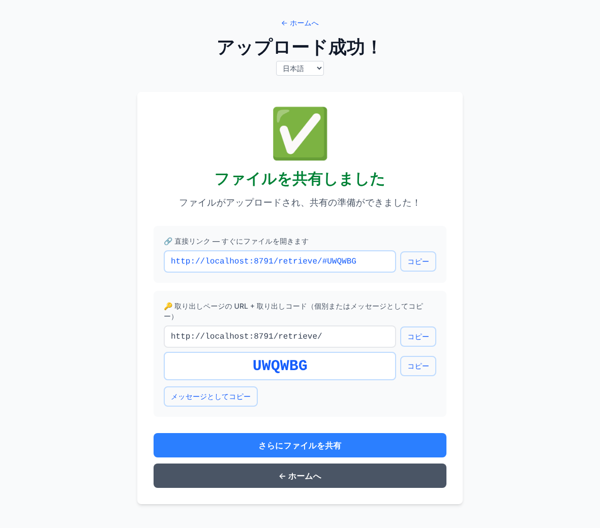
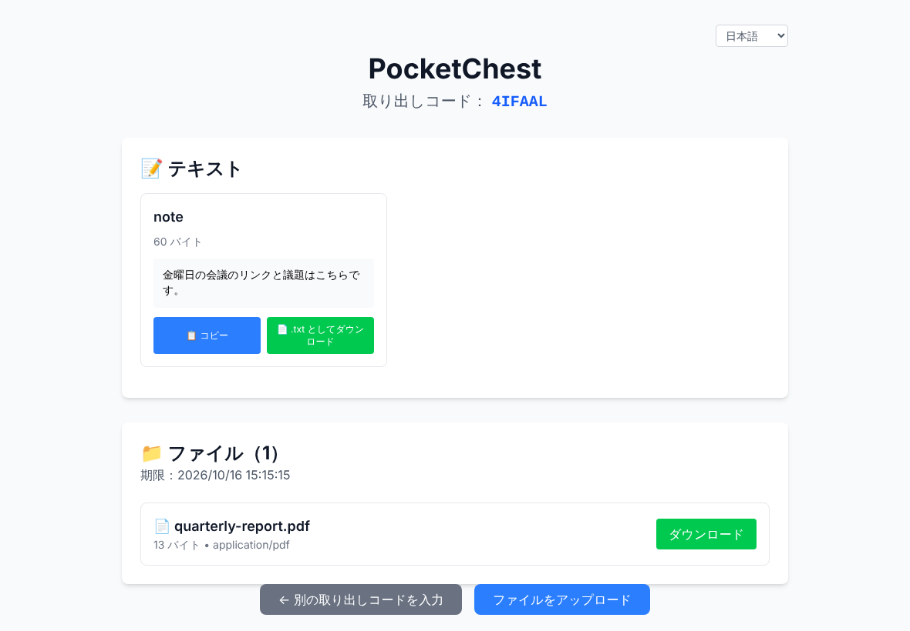
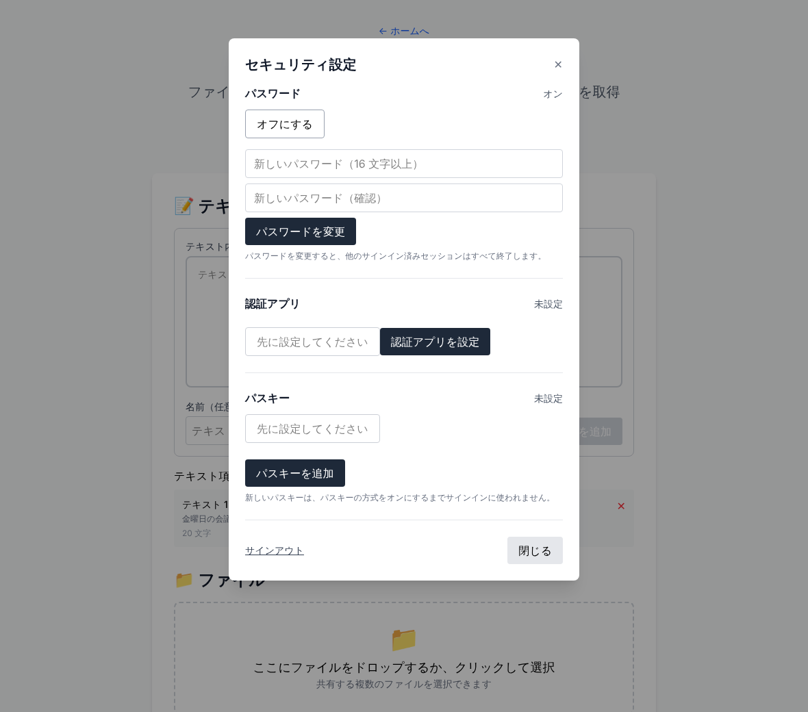
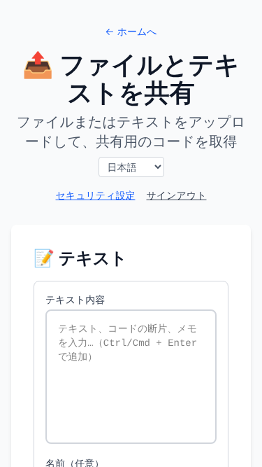
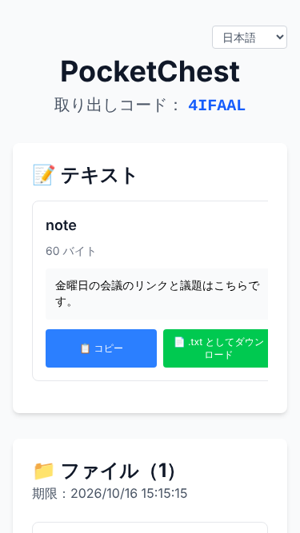

# PocketChest

[English](README.md) | [繁體中文](README.zh-Hant.md) | [日本語](README.ja.md)

> ファイルとテキストを共有する、自分で運用するプライベートな仕組み。Cloudflare Worker 1 つと R2 バケット 1 つだけで、データベースは不要です。

## 🚀 すぐにデプロイ

[](https://deploy.workers.cloudflare.com/?url=https://github.com/lpyedge/PocketChest)

**ワンクリックデプロイ** · [デプロイガイド](DEPLOYMENT.ja.md) · [手動デプロイ](DEPLOYMENT.ja.md#2-手動デプロイ)

ボタンは、このリポジトリを自分の GitHub アカウントにコピーし、Workers Builds でビルドして R2 バケットを作成します。自分で決めるのは **オーナーのパスワード** を一度だけです。署名用のシークレットは自動で作られ、サイトが「アカウントのセットアップ」を求めることもありません。アップグレードでは何も入力しません。ガイドでは、ボタン、`npm run deploy`、手動の GitHub Actions デプロイ、デプロイ後の確認項目を説明しています。**実際の Cloudflare アカウントではまだ検証していません。**ワンクリックの流れ（ボタンが `npm run deploy` を埋めること、シークレットのフォーム、Workers Builds）は、Cloudflare の応答を模擬したローカルテストだけです。ボタンでデプロイできたことは、本番環境の検証が済んだことを意味しません。

## ✨ 主な機能

- パスワード、認証アプリ（TOTP）、パスキーは独立した 3 つのサインイン方法で、どれか 1 つで十分です（認証アプリのコードは、パスワードの後の第二段階では**ありません**）。少なくとも 1 つはオンのままにします。認証アプリとパスキーは任意で、サインイン後に設定し、最初の 1 つは確認できた時点ですぐ使えます。
- アップロードできるのはオーナーだけです。受け取る人は取り出しコード、または `#CODE` 付きの直接リンクで、サインインなしで受け取れます。**共有の記録**で有効な共有を一覧し、オーナーが延長や取り消しをできます。
- テキストと大きなファイル（マルチパート）、有効期間は 1／3／7／14 日または無期限、毎時の自動クリーンアップ。
- 繁体字中国語・日本語・英語。言語ごとの静的ホームページ付き。
- Worker、Workers Static Assets、R2 だけで動きます。D1 も KV も別のウェブサービスも使いません。

## 📦 使い方

1. `/upload/` で、オンになっている方法のどれかでサインインします。
2. ファイルまたはテキストを追加し、有効期間を選んで共有を完了します。
3. 直接リンク `/retrieve/#CODE`、または取り出しページのアドレスとコードを別々にコピーします。
4. 受け取る人はアカウントなしで受け取れます。

## 🖼️ 画面キャプチャ

| | |
|:--:|:--:|
| <br>ホーム | <br>オーナーのサインイン |
| <br>アップロード | <br>共有結果 |
| <br>受け取り | <br>セキュリティ設定 |

 

`npm run screenshots` が現在のビルドから撮影したものです（[docs/SCREENSHOTS.md](docs/SCREENSHOTS.md) 参照）。表示されているコードは使い捨てのテスト用データです。

## 🛡️ セキュリティと現在の制限

- アップロードのセッションは開始から 24 時間です。それ以降の再開には対応していません。
- パスワードは、Worker 自身のシークレットから導出した鍵によるソルト付き HMAC で保存します（Workers Free プランでも負担が小さい方式です）。長く、他で使っていないパスワードにしてください。サインインにはレート制限があり、失敗が続くとロックされます。パスワードはオフラインではリセットできません。[復旧](docs/RECOVERY.md)を参照してください。
- ここにあるものはすべてローカルで（ユニット、Worker ランタイム、ブラウザの E2E）テスト済みです。頼りにする前に、R2 の同時実行、Cron、レート制限、独自ドメインでのパスキー、大きなファイル、ワンクリックの流れを Cloudflare 上で確認する必要があります。[docs/REMOTE_ACCEPTANCE.md](docs/REMOTE_ACCEPTANCE.md) を参照してください。
- CSP は Report-Only で、ダウンロードは `Range` による再開に対応していません。詳細は [docs/OPERATIONS.md](docs/OPERATIONS.md#known-limits)。

## 🛠️ 開発とテスト

```bash
npm ci
npm run setup:local        # 新しいランダムなシークレットで .dev.vars を作成
npm run preview            # ビルドして http://localhost:8787 で Worker 全体を実行
```

CI でも同じ確認を実行します。

```bash
npm run typecheck && npm run lint && npm run format:check
npm run test:unit && npm run test:worker && npm run test:contracts && npm run test:scripts
npm run test:e2e           # Playwright（デスクトップと 375px）
npm run build && npx wrangler deploy --dry-run
```

[アーキテクチャ](docs/ARCHITECTURE.md) · [API](docs/API.md) · [運用](docs/OPERATIONS.md) · [オーナーの復旧](docs/RECOVERY.md) · [Cloudflare での検証](docs/REMOTE_ACCEPTANCE.md)

## 🔀 プロジェクトの由来と追加機能

[Hzao/PocketChest](https://github.com/Hzao/PocketChest) からのフォークです。このフォークでは、Worker 1 つ + R2 のみの構成、ワンクリックデプロイ、オーナー限定のアップロード、パスワード／TOTP／パスキーの独立したサインイン、セキュリティ設定、多言語 UI、共有リンクの改善、レート制限とクリーンアップの強化を加えました。独立したフォークであり、元の作者による承認を示すものではありません。

ライセンスはリポジトリの [LICENSE](LICENSE) に従います。
