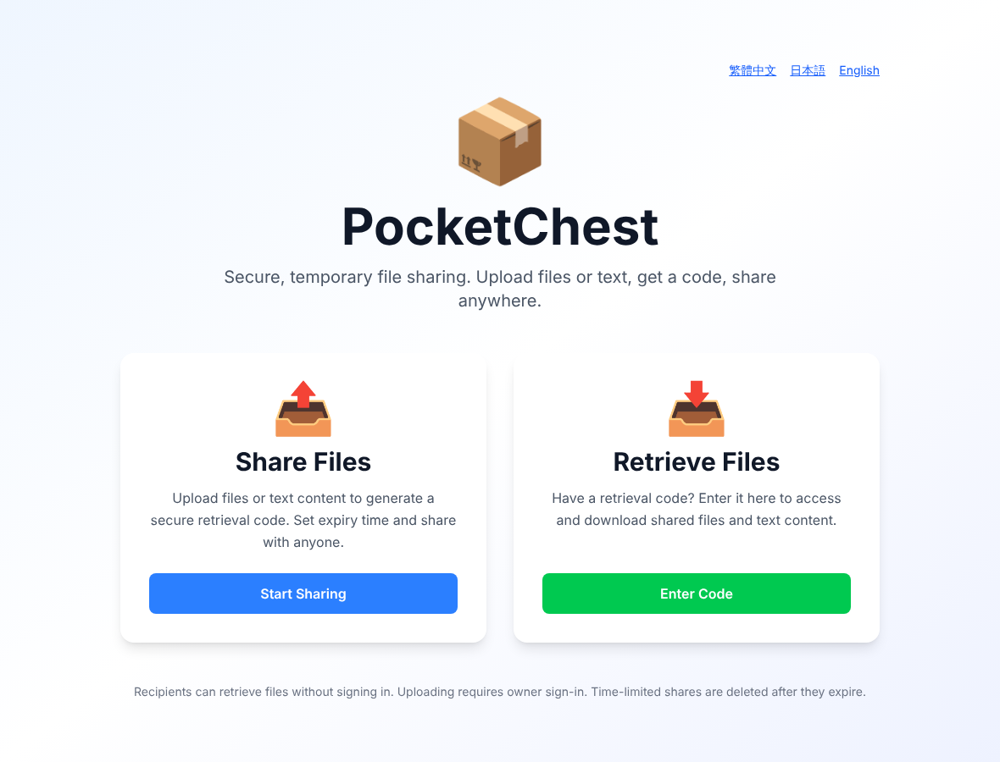
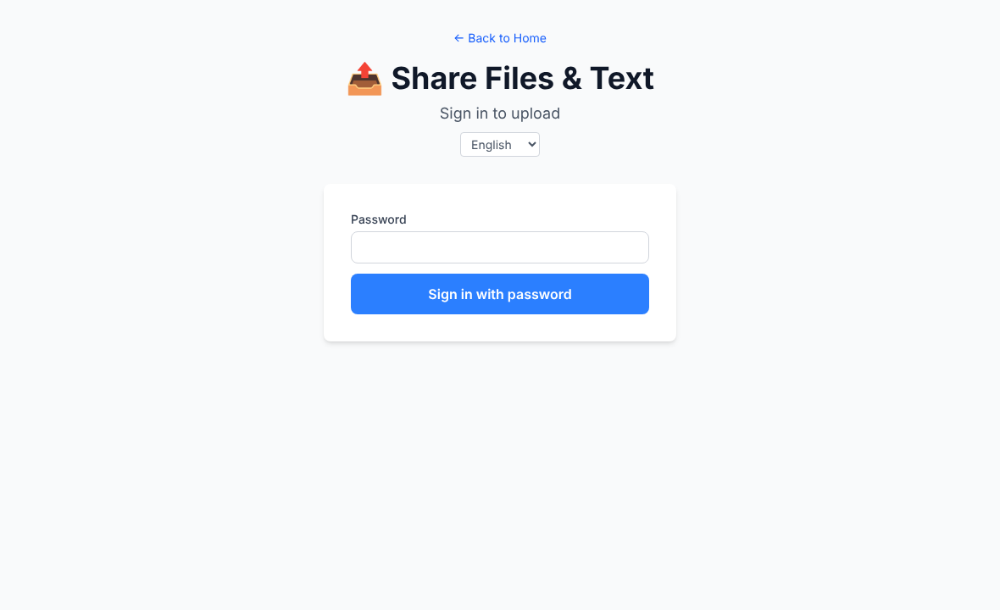
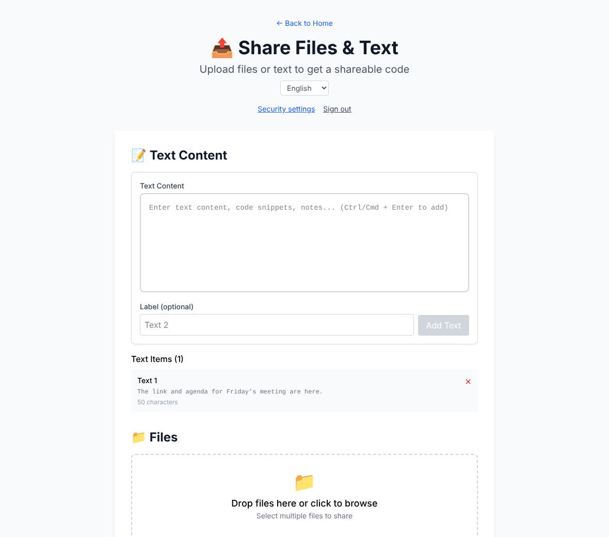
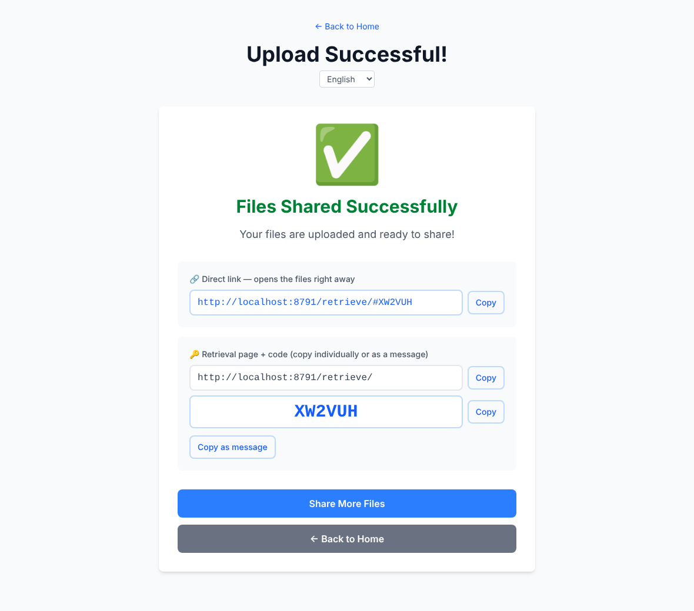
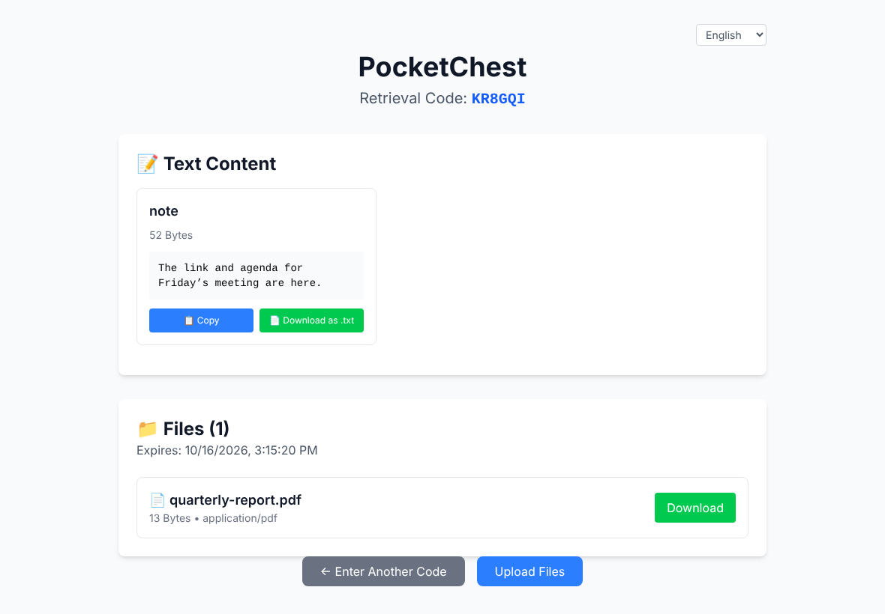
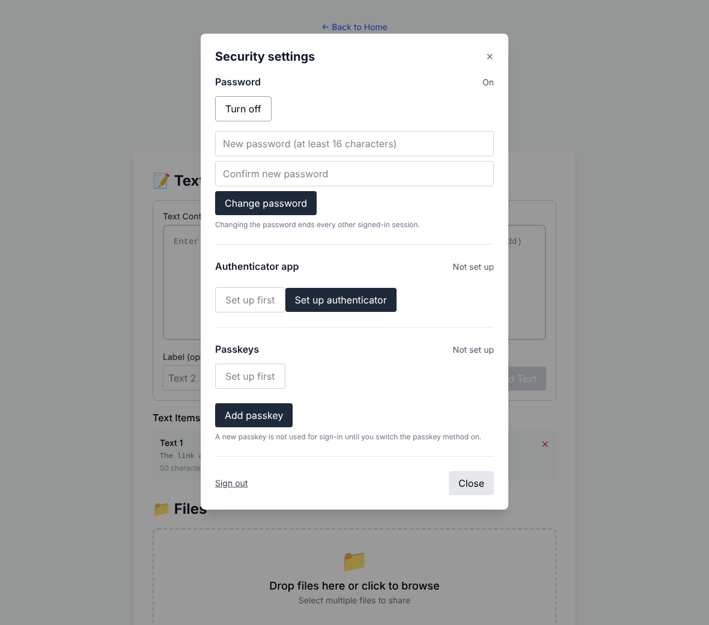
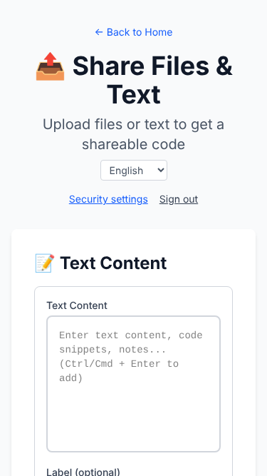
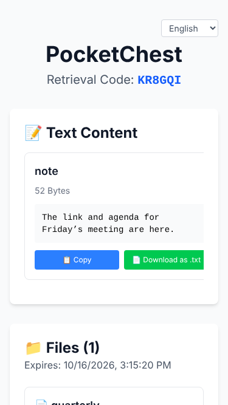

# PocketChest

[English](README.md) | [繁體中文](README.zh-Hant.md) | [日本語](README.ja.md)

> Private, self-hosted sharing for files and text. One Cloudflare Worker, one R2 bucket, no database.

## 🚀 Deploy in minutes

[](https://deploy.workers.cloudflare.com/?url=https://github.com/lpyedge/PocketChest)

**One-click deployment** · [Full deployment guide](DEPLOYMENT.md) · [Manual deployment](DEPLOYMENT.md#2-manual-deployment)

The button clones this repository into your GitHub account, builds it with Workers Builds and creates the R2 bucket. The only thing you choose is your **Owner password**, once; the signing secret is generated for you and the site never asks you to "set up" an account. Upgrading asks for nothing. The guide covers the button, `npm run deploy` and a manual GitHub Actions deploy, and what to check afterwards. **Not yet verified on a real Cloudflare account:** the one-click chain (the button prefilling `npm run deploy`, the secrets form, Workers Builds) has only been tested locally with simulated Cloudflare answers; a successful button deployment is not a production acceptance test.

## ✨ Features

- Password, authenticator app (TOTP) or passkey: three independent ways to sign in, any one is enough (an authenticator code is **not** a second step after the password). At least one stays on. An authenticator or passkey is optional and set up after signing in; the first one works as soon as it is confirmed.
- Owner-only uploads. Recipients use a retrieval code or a direct `#CODE` link, without signing in. **Share records** lists active shares, and lets the owner extend or revoke them.
- Text and large files (multipart), shares of 1, 3, 7 or 14 days or permanent, hourly cleanup.
- Traditional Chinese, Japanese and English, including a static home page in each language.
- One Worker, Workers Static Assets and R2. No D1, KV or separate web service.

## 📦 How it works

1. Sign in at `/upload/` with any sign-in method that is on.
2. Add files or text, choose how long the share lasts, and finish.
3. Copy the direct link `/retrieve/#CODE`, or the retrieval page address and the code separately.
4. Recipients retrieve the files without an account.

## 🖼️ Screenshots

| | |
|:--:|:--:|
| <br>Home | <br>Owner sign-in |
| <br>Upload | <br>Share result |
| <br>Retrieve | <br>Security settings |

 

Captured from the current build by `npm run screenshots` (see [docs/SCREENSHOTS.md](docs/SCREENSHOTS.md)); the codes shown are throw-away test data.

## 🛡️ Security and current limits

- An upload session lasts 24 hours from its start; resuming after that is not supported.
- The password is stored as a salted HMAC under a key the Worker derives from its own secret (cheap enough for the Workers Free plan). Use a long password you use nowhere else; sign-in is also rate-limited and locks after repeated failures. The password cannot be reset offline: see [recovery](docs/RECOVERY.md).
- Everything here was tested locally (unit, Worker-runtime, end-to-end in a browser). Cloudflare-side checks (R2 concurrency, Cron, rate limits, passkeys on your domain, large files, the one-click chain) are still yours to run before relying on it: see [docs/REMOTE_ACCEPTANCE.md](docs/REMOTE_ACCEPTANCE.md).
- CSP is report-only and downloads do not support `Range` resume. Details: [docs/OPERATIONS.md](docs/OPERATIONS.md#known-limits).

## 🛠️ Development

```bash
npm ci
npm run setup:local        # writes .dev.vars with fresh random secrets
npm run preview            # build, then run the whole Worker on http://localhost:8787
```

The same checks run in CI:

```bash
npm run typecheck && npm run lint && npm run format:check
npm run test:unit && npm run test:worker && npm run test:contracts && npm run test:scripts
npm run test:e2e           # Playwright, desktop and 375px
npm run build && npx wrangler deploy --dry-run
```

[Architecture](docs/ARCHITECTURE.md) · [API](docs/API.md) · [Operations](docs/OPERATIONS.md) · [Owner recovery](docs/RECOVERY.md) · [Cloudflare acceptance](docs/REMOTE_ACCEPTANCE.md)

## 🔀 Project origin and enhancements

Forked from [Hzao/PocketChest](https://github.com/Hzao/PocketChest). This fork adds a single Worker + R2-only architecture, one-click deployment, owner-only uploads, independent password / TOTP / passkey sign-in, security settings, a localized interface, better share links, rate limiting and cleanup. It is an independent fork; no endorsement by the upstream author is implied.

Licensed under the repository's [LICENSE](LICENSE).
