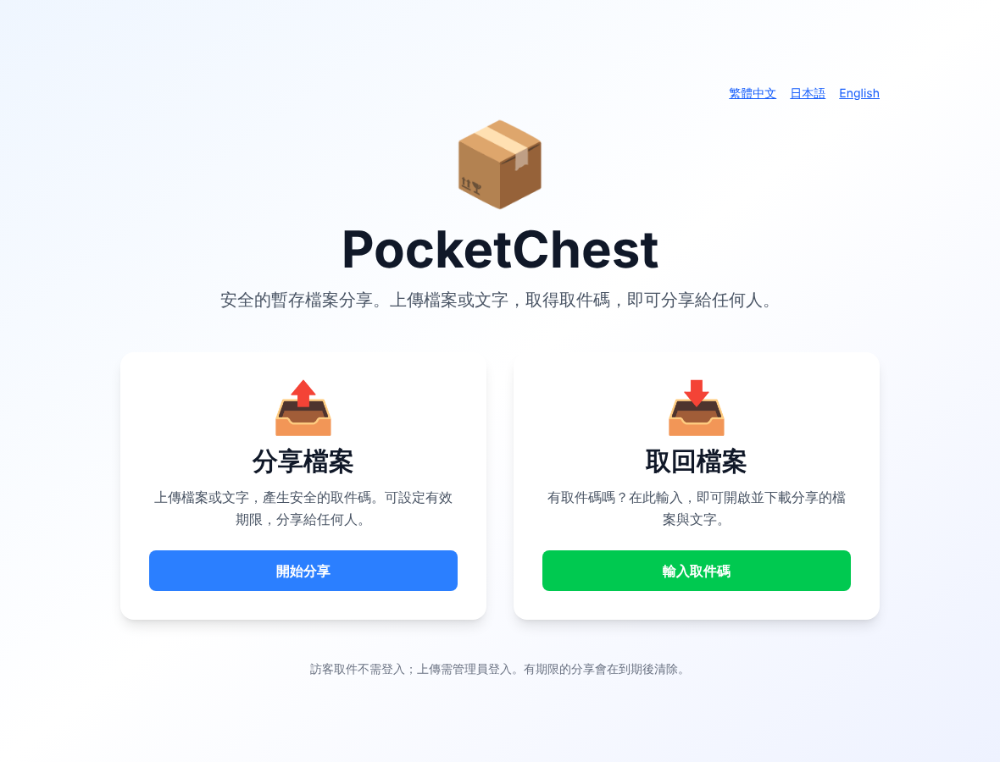
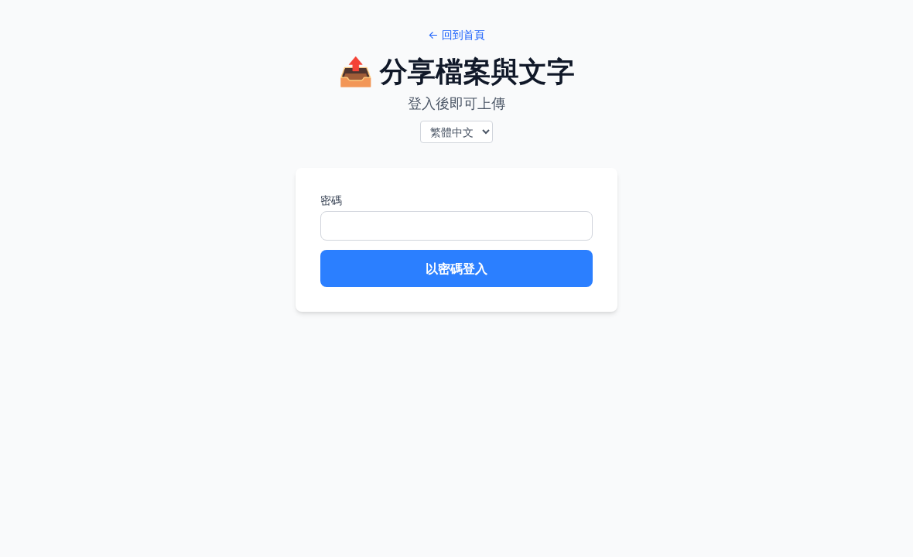
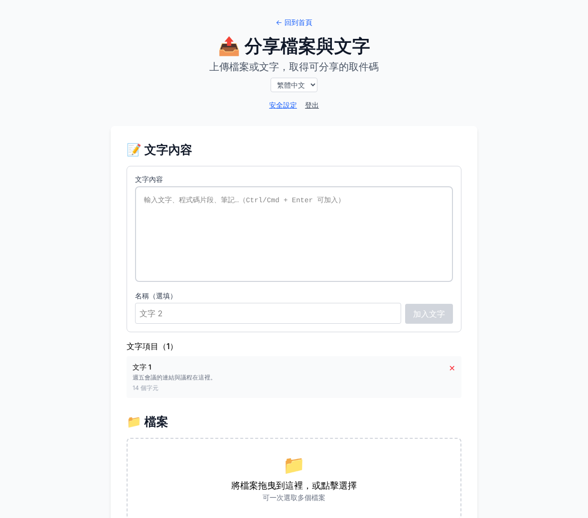
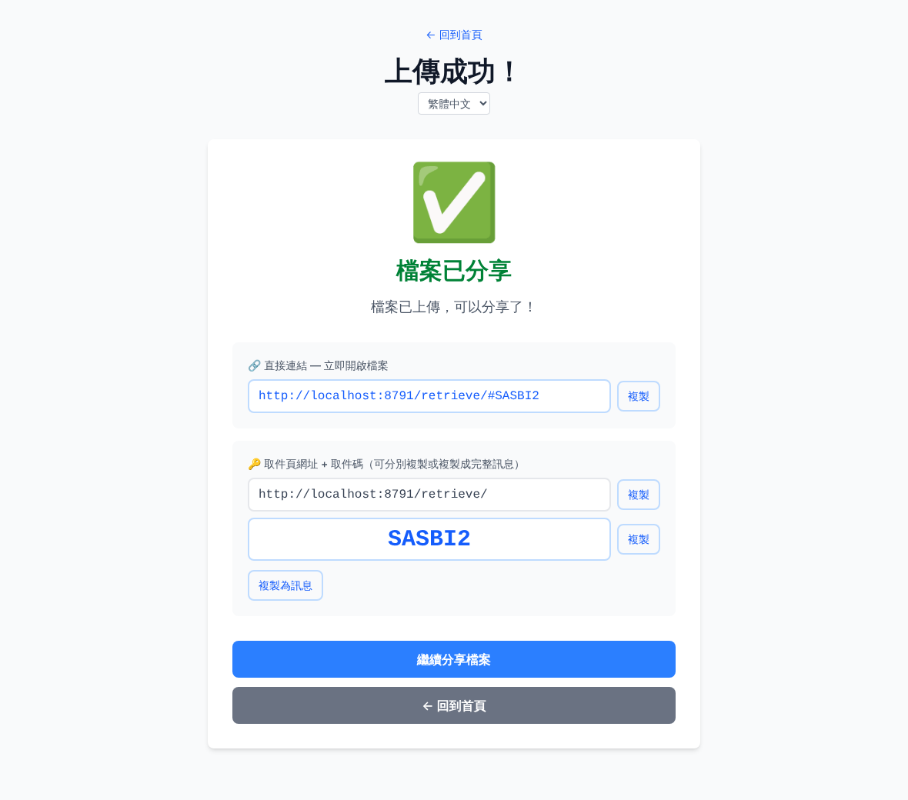
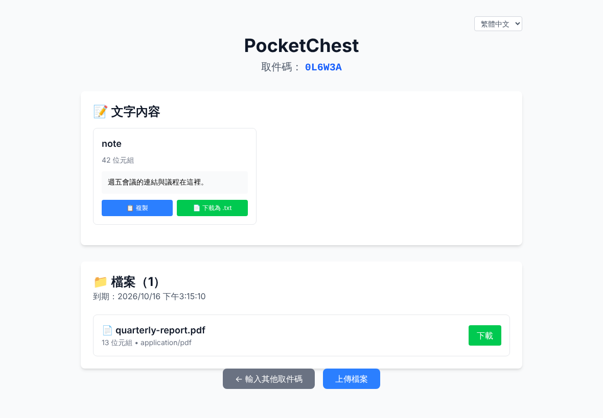
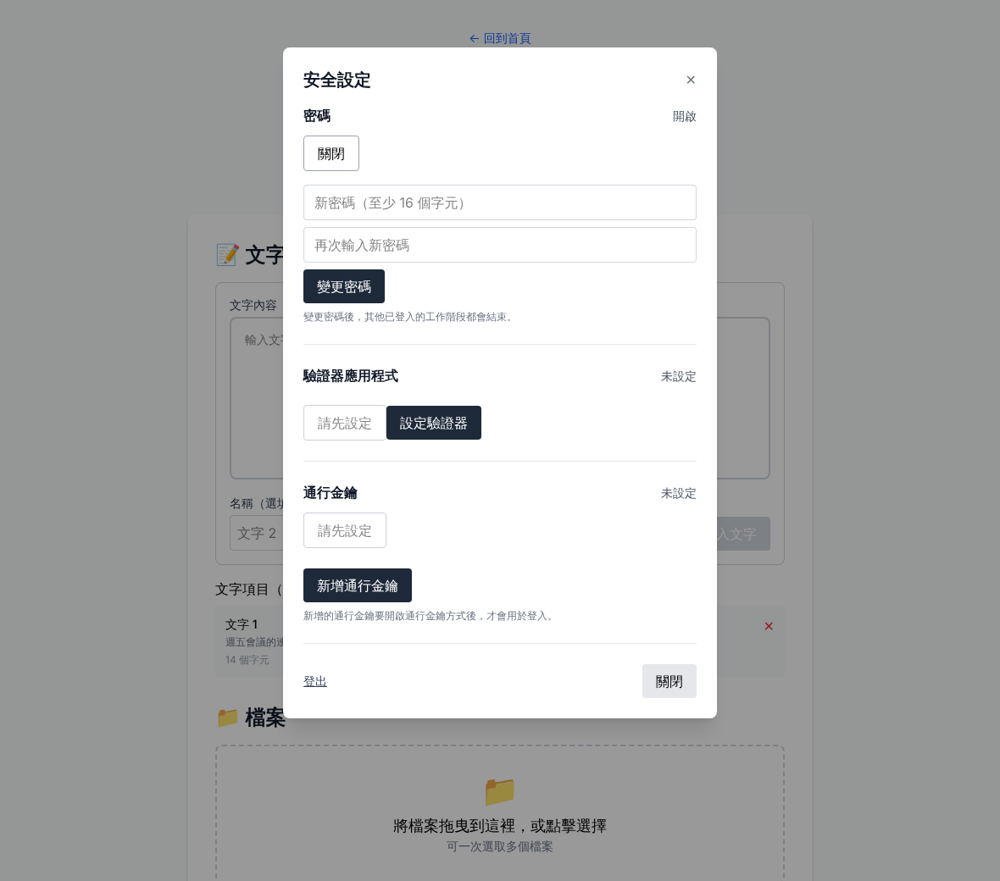
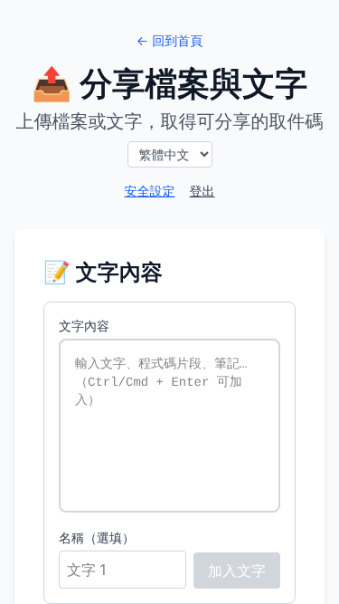
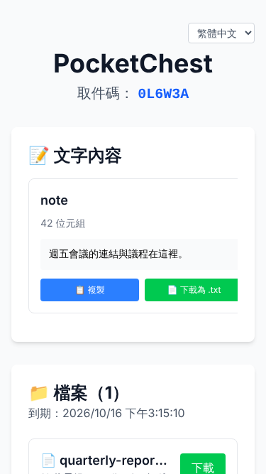

# PocketChest

[English](README.md) | [繁體中文](README.zh-Hant.md) | [日本語](README.ja.md)

> 私有化檔案與文字分享。只需一個 Cloudflare Worker、一個 R2 Bucket，不依賴資料庫。

## 🚀 快速部署

[](https://deploy.workers.cloudflare.com/?url=https://github.com/lpyedge/PocketChest)

**一鍵部署** · [完整部署指南](DEPLOYMENT.zh-Hant.md) · [手動部署](DEPLOYMENT.zh-Hant.md#2-手動部署)

按鈕會把本倉庫複製到你的 GitHub 帳號，用 Workers Builds 建置並建立 R2 Bucket。你只需要決定一次 **Owner 密碼**；簽章用的 Secret 會自動產生，網站也不會再要你「設定」帳號。升級不需要輸入任何東西。指南涵蓋按鈕、`npm run deploy` 與手動的 GitHub Actions 部署，以及部署後該檢查的項目。**尚未在真實 Cloudflare 帳號上驗證：**一鍵流程（按鈕預填 `npm run deploy`、Secret 表單、Workers Builds）目前只用模擬的 Cloudflare 回應在本機測過；按鈕部署成功並不等於已通過正式環境驗收。

## ✨ 主要功能

- 密碼、驗證器 App（TOTP）、Passkey 是三種獨立的登入方式，任何一種就足夠（驗證器代碼**不是**密碼之後的第二步）；至少保持一種啟用。驗證器與 Passkey 都是選用的，登入後才設定，第一個確認後立即可用。
- 只有 Owner 可以上傳；取件者憑取件碼或 `#CODE` 直接連結取件，無須登入。**分享記錄**可列出有效的分享，並讓 Owner 延長或撤銷。
- 文字與 Multipart 大檔；分享期限可選 1／3／7／14 天或永久；每小時自動清理。
- 繁體中文、日文、英文，並有各語言的靜態首頁。
- 單一 Worker + Workers Static Assets + R2；不使用 D1、KV 或獨立前端服務。

## 📦 使用流程

1. 前往 `/upload/`，用任一已啟用的方式登入。
2. 加入檔案或文字，選擇分享期限，完成分享。
3. 複製 `/retrieve/#CODE` 直接連結，或分開複製取件頁網址與取件碼。
4. 取件者無須帳號即可取件。

## 🖼️ 介面截圖

| | |
|:--:|:--:|
| <br>首頁 | <br>Owner 登入 |
| <br>上傳 | <br>分享結果 |
| <br>取件 | <br>安全設定 |

 

截圖由 `npm run screenshots` 從目前的建置擷取（見 [docs/SCREENSHOTS.md](docs/SCREENSHOTS.md)）；畫面中的取件碼只是用完即丟的測試資料。

## 🛡️ 安全說明與目前限制

- 上傳 Session 從建立起有效 24 小時；不支援超過期限的續傳。
- 密碼以加鹽 HMAC 儲存，金鑰由 Worker 自己的 Secret 衍生（負擔小，適合 Workers Free 方案）。請用夠長、且不在別處使用的密碼；登入也有限流，多次失敗會鎖定。密碼無法離線重設，見[復原](docs/RECOVERY.md)。
- 這裡的一切都在本機測過（單元、Worker 執行環境、瀏覽器端對端）。倚賴它之前，仍需自行在 Cloudflare 上驗證 R2 並發、Cron、限流、自訂網域的 Passkey、大檔與一鍵流程，見 [docs/REMOTE_ACCEPTANCE.md](docs/REMOTE_ACCEPTANCE.md)。
- CSP 目前是 Report-Only，下載不支援 `Range` 續傳。詳見 [docs/OPERATIONS.md](docs/OPERATIONS.md#known-limits)。

## 🛠️ 開發與測試

```bash
npm ci
npm run setup:local        # 以全新的隨機 Secret 產生 .dev.vars
npm run preview            # 建置後在 http://localhost:8787 執行整個 Worker
```

CI 執行同樣的檢查：

```bash
npm run typecheck && npm run lint && npm run format:check
npm run test:unit && npm run test:worker && npm run test:contracts && npm run test:scripts
npm run test:e2e           # Playwright，桌面與 375px
npm run build && npx wrangler deploy --dry-run
```

[架構](docs/ARCHITECTURE.md) · [API](docs/API.md) · [維運](docs/OPERATIONS.md) · [Owner 復原](docs/RECOVERY.md) · [Cloudflare 驗收](docs/REMOTE_ACCEPTANCE.md)

## 🔀 專案來源與新增功能

本專案 Fork 自 [Hzao/PocketChest](https://github.com/Hzao/PocketChest)。此分支新增單 Worker + R2-only 架構、一鍵部署、Owner 限定上傳、密碼／TOTP／Passkey 三種獨立登入、安全設定、三語介面、分享連結改善、限流與清理強化。這是獨立 Fork，不代表原作者為修改版本背書。

授權條款見本倉庫的 [LICENSE](LICENSE)。
